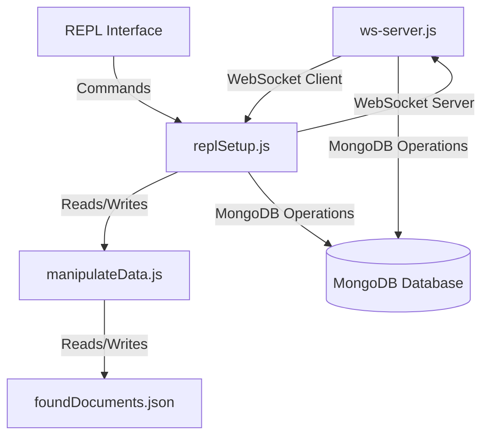

```mermaid
flowchart TD
    A[ws-server.js] -->|WebSocket Client| B[replSetup.js]
    B -->|WebSocket Server| A
    B -->|Reads/Writes| C[manipulateData.js]
    C -->|Reads/Writes| D[foundDocuments.json]
    A -->|MongoDB Operations| E[(MongoDB Database)]
    B -->|MongoDB Operations| E
    F[REPL Interface] -->|Commands| B
```
